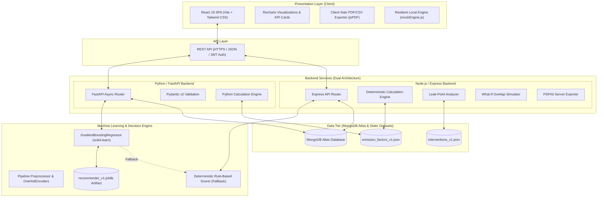

# CarboTrack — Industrial Emission Leak-Point Detector & Circular Alternative Recommender
### HackOut 2026 — Renewable Energy Intelligence & Circular Carbon Ecosystem

[](https://vitejs.dev/)
[](https://react.dev/)
[](https://tailwindcss.com/)
[](https://nodejs.org/)
[](https://fastapi.tiangolo.com/)
[](https://scikit-learn.org/)
[](https://www.mongodb.com/)

---

## 📌 Executive Summary

Small and Medium-sized Enterprises (SMEs) in heavy industrial sectors (plastics, textiles, food processing) generate over **40% of global industrial emissions**, yet lack the dedicated ESG teams and enterprise software suites used by conglomerates. When facing carbon tax pressures and supply-chain disclosure mandates, plant managers face two core dilemmas:
1. **Opacity:** Difficulty pinpointing exactly which fuel line, resin feed, or waste effluent drives their emissions footprint.
2. **Action Paralysis:** Inability to assess which circular-economy interventions are technically viable, financially realistic, and capable of reducing emissions without disrupting manufacturing operations.

**CarboTrack** solves this through a closed-loop **Diagnostic-to-Prescription Pipeline**:
```
Facility Intake ➔ Deterministic CO₂e Engine ➔ Leak-Point Diagnostics ➔ ML & Rule Recommendation Engine ➔ What-If Simulator ➔ Phased Action Roadmap ➔ Audit-Grade PDF/CSV Reports
```

---

## 🏛️ Architectural Principles & Trust Model

The platform is designed around strict auditability and anti-hallucination guarantees:

```
┌─────────────────────────────────────────────────────────────────────────┐
│                      THE THREE-TIER TRUST MODEL                         │
├───────────────────────┬─────────────────────────┬───────────────────────┤
│ 1. CALCULATED         │ 2. ESTIMATED            │ 3. SCORED & RANKED    │
│ (Authoritative Truth) │ (Curated Research)      │ (Decision Support)    │
├───────────────────────┼─────────────────────────┼───────────────────────┤
│ • Activity × Factor   │ • CapEx & OpEx Ranges   │ • ML Gradient Boost   │
│ • GHG Protocol Scopes │ • CO₂ Abatement Rates   │ • Rule-Based Scorer   │
│ • Versioned Datasets  │ • Payback Period (yrs)  │ • Explainability Flags│
│ • Deterministic math  │ • Industry Benchmarks   │ • Multi-criteria Rank │
└───────────────────────┴─────────────────────────┴───────────────────────┘
```

- **Zero AI-Hallucinated Math:** Greenhouse gas emissions arithmetic is strictly deterministic (`Activity Quantity × Sourced Emission Factor`). AI is never permitted to fabricate emission numbers.
- **Auditable Provenance:** Every metric maps to GHG Protocol scopes (Scope 1: Direct Combustion, Scope 2: Purchased Electricity, Scope 3: Upstream Materials & Downstream Waste).
- **Graceful ML Degradation:** The Machine Learning ranker is layered on top of an identical-contract deterministic rule-based scorer. If ML inference is offline, the system seamlessly falls back to domain-rule scoring without frontend disruption.

---

## 📐 System Architecture

### Architectural Topology



---

## ⚡ Technology Stack

### Frontend Application
- **Core Library:** [React 19](https://react.dev/) with modern hooks (`useMemo`, `useCallback`, `useContext`)
- **Build System & Dev Server:** [Vite 8](https://vitejs.dev/) with `@vitejs/plugin-react`
- **Styling & UI Components:** [Tailwind CSS 3.4](https://tailwindcss.com/), `@tailwindcss/forms`, Autoprefixer, PostCSS
- **Interactive Visualizations:** [Recharts 3.10](https://recharts.org/) (Donut charts, Stacked bar charts, Ranked horizontal bars, Waterfall charts)
- **Routing:** [React Router 7](https://reactrouter.com/) with nested layout shells and protected routes
- **Iconography:** [Lucide React](https://lucide.dev/)
- **Client-Side Export:** [jsPDF 4.2](https://github.com/parallax/jsPDF) with auto-table generation and formatting

### Backend Services (Dual-Stack Flexibility)
#### Option A: Node.js / Express Server
- **Runtime:** Node.js (v18+)
- **Framework:** Express 4.19
- **Database ODM:** Mongoose 8.5 connecting to MongoDB Atlas
- **Authentication:** JSON Web Tokens (`jsonwebtoken`) & `bcryptjs`
- **PDF Generation:** `pdfkit`
- **CORS & Middleware:** `cors`, `dotenv`

#### Option B: Python / FastAPI Server
- **Runtime:** Python 3.10+
- **Framework:** FastAPI with Uvicorn ASGI server
- **Validation:** Pydantic v2 schemas
- **Database Driver:** Motor (AsyncIO MongoDB driver)
- **Environment:** `python-dotenv`, `python-jose`

### Machine Learning & Data Science
- **ML Framework:** [scikit-learn](https://scikit-learn.org/) `Pipeline`, `GradientBoostingRegressor`
- **Data Engineering:** [pandas](https://pandas.pydata.org/), [NumPy](https://numpy.org/)
- **Model Serialization:** [Joblib](https://joblib.readthedocs.io/)
- **Feature Engineering:** One-Hot Encoding (`industry`, `leak_category`, `implementation_difficulty`), numerical standard scalers, and domain affordability ratios
- **Evaluation Metrics:** Top-K Agreement (Spearman Rank Correlation), Mean Absolute Error (MAE), and Pairwise Ranking Consistency

---

## ✨ Key Features & User Journey

### 1. Multi-Facility Management & Role-Based Access
- Role-based capabilities (Plant Manager vs. Operations Engineer).
- Multi-facility switcher with support for different industrial profiles:
  - **Plastic Injection & Extrusion** (virgin pellets, recycled feed, thermal curing, regrind)
  - **Textile & Apparel Manufacturing** (cotton/polyester spinning, wet dyeing, effluent treatment)
  - **Food & Beverage Processing** (cold storage, steam boilers, organic effluent, packaging)

### 2. Six-Step Guided Data Intake Wizard
- **Step 0 — Facility Setup:** Plant size (Small, Medium, Large), geographic region, and annual production volumes.
- **Step 1 — Energy & Utilities (Scope 1 & 2):** Grid electricity (kWh), diesel generators (Liters), natural gas (MMBtu/m³), LPG, coal.
- **Step 2 — Raw Materials & Feedstocks (Scope 3 Upstream):** Virgin polymers (PP, HDPE, LDPE, PET), virgin cotton/synthetic yarn, raw agricultural inputs.
- **Step 3 — Waste & Effluents (Scope 3 Downstream):** Scrap trim, rejected components, landfill solid waste, incinerated waste, and wastewater discharge.
- **Step 4 — Review & Verification:** Real-time data validation and unit normalization before emission execution.
- **Step 5 — Deterministic Calculation:** Automated conversion to metric tonnes of CO₂ equivalent ($t\text{CO}_2\text{e}$).

### 3. Comprehensive Analytical Dashboards
- **Overview Dashboard:** Total footprint ($t\text{CO}_2\text{e}$), identified leak count, potential reduction volume, estimated implementation cost, and Scope 1/2/3 breakdown.
- **Emission Analysis Dashboard:** Complete auditable register with search, category filtering (Energy/Materials/Waste), sorting, and CSV export.
- **Leak-Point Diagnostics:** Automated Pareto-ranking of carbon hot-spots with dynamic severity badges:
  - 🔴 **High Severity:** $\ge 30\%$ contribution to total plant emissions
  - 🟡 **Medium Severity:** $15\% - 29.9\%$ contribution
  - 🟢 **Low Severity:** $< 15\%$ contribution

### 4. Circular Alternative Recommender (ML + Rule Engine)
- Contextual recommendation matching against facility leak points.
- **Adoption Score (0–100):** Evaluates emission reduction potential, capital affordability against facility operational budget, payback timeframe, and technical feasibility.
- **Transparent Explainability Flags:**
  - `High emission contribution`
  - `Strong industry fit`
  - `Low capital expenditure` / `High ROI payback`
  - `Straightforward implementation`
- **Proven Fallback:** Guaranteed deterministic rule-based scorer if ML weights cannot be evaluated.

### 5. Overlap-Aware "What-If" Scenario Simulator
- Interactive simulation of single or combined circular interventions.
- **Anti-Double-Counting Physics:** When two interventions address the identical leak point (e.g., *Rooftop Solar PPA* and *Variable Speed Drive Retrofits* both addressing grid electricity), the engine takes the higher reduction estimate rather than naively summing them.
- Real-time recalculation of projected footprint, net emission reduction %, total required investment, and estimated annual operational savings.

### 6. Phased Carbon Reduction Roadmap
- Automated assignment of recommended initiatives into structured implementation stages:
  - 🚀 **Phase 1 — Quick Wins:** Low CapEx, high payback, minimal downtime (< 6 months)
  - ⚙️ **Phase 2 — Medium Term:** Moderate investment, substantial emission abatement (6–18 months)
  - 🏗️ **Phase 3 — Long-Term Strategic:** High-impact capital retrofits & supply-chain transformations (18–36 months)
- Status management (`Suggested`, `In Progress`, `Completed`) with interactive manual overrides.

### 7. Audit Reports & Longitudinal History
- **Assessment Versioning:** Save and compare multiple iterations over time (e.g., Baseline 2025 vs. Post-Intervention 2026).
- **Report Generation:** Generates branded, regulator-ready PDF audit certificates and complete CSV data logs.

---

## 🗂️ Project Directory Structure

```
Hackout2026/
├── .env.example                     # Environment template
├── package.json                     # Monorepo/subproject config
├── datasets/                        # Sourced, immutable domain datasets
│   ├── emission_factors/
│   │   └── emission_factors_v1.json # GHG emission factors by scope & category
│   └── intervention_library/
│       └── interventions_v1.json    # Catalog of circular interventions
│
├── frontend/                        # React 19 Frontend Application
│   ├── index.html
│   ├── package.json
│   ├── vite.config.js
│   ├── tailwind.config.js
│   └── src/
│       ├── App.jsx
│       ├── main.jsx
│       ├── index.css                # Design system styling & custom utilities
│       ├── api/
│       │   ├── client.js            # Unified API client with automatic JWT injection
│       │   └── mockEngine.js        # Built-in standalone offline mock engine
│       ├── components/
│       │   ├── common/              # KpiCard, DataTable, LoadingSkeleton, etc.
│       │   └── layout/              # AppLayout, Sidebar, TopNav, StepperNav
│       ├── context/
│       │   └── FacilityAssessmentContext.jsx # Global active facility & assessment store
│       ├── pages/                   # All 10 application views
│       │   ├── Login.jsx
│       │   ├── FacilitySetup.jsx
│       │   ├── IntakeWizard.jsx
│       │   ├── OverviewDashboard.jsx
│       │   ├── EmissionAnalysisDashboard.jsx
│       │   ├── LeakPointDashboard.jsx
│       │   ├── RecommendationDashboard.jsx
│       │   ├── WhatIfSimulator.jsx
│       │   ├── ActionRoadmap.jsx
│       │   └── ReportsHistory.jsx
│       └── utils/
│           └── reportExporter.js    # PDF & CSV generator using jsPDF
│
├── backend/                         # Backend Services
│   ├── package.json                 # Node.js backend configuration
│   ├── requirements.txt             # Python FastAPI backend dependencies
│   ├── src/                         # Node.js / Express Implementation
│   │   ├── index.js                 # Express server entry point
│   │   ├── db/connection.js         # MongoDB connection lifecycle
│   │   ├── models/                  # Mongoose schemas (Facility, Assessment, etc.)
│   │   ├── routes/                  # API endpoints (auth, facilities, assessments)
│   │   └── services/                # Business logic (calc engine, leak analysis, etc.)
│   └── app/                         # Python / FastAPI Implementation
│       ├── main.py                  # FastAPI server entry point
│       ├── core/                    # Config, Mongo async connection, errors
│       ├── routers/                 # FastAPI routers
│       └── services/                # Calculation and simulation engines
│
├── ml/                              # Machine Learning Pipeline
│   ├── data/                        # Training datasets & features
│   ├── pipeline/
│   │   ├── preprocessor.py          # Scikit-learn Pipeline transformations
│   │   ├── rule_based_scorer.py     # Deterministic baseline scorer & fallback
│   │   └── train.py                 # GradientBoostingRegressor training script
│   ├── inference/
│   │   └── ranker.py                # Model inference runner
│   └── models/
│       └── recommender_v1.joblib    # Serialized scikit-learn model artifact
│
└── models/                          # Shared model artifacts directory
    └── recommender_v1.joblib
```

---

## 🚀 Installation & Setup Guide

### 1. Prerequisites
- **Node.js**: v18.0.0 or higher
- **npm**: v9.0.0 or higher
- **Python**: v3.10 or higher *(for ML pipeline or FastAPI backend)*
- **MongoDB**: MongoDB Atlas connection string or local MongoDB instance

---

### 2. Environment Configuration

Create a `.env` file in `Hackout2026/` (or copy `.env.example`):
```bash
cp .env.example .env
```

Edit `.env`:
```ini
MONGODB_URL=mongodb+srv://<USERNAME>:<PASSWORD>@<CLUSTER>.mongodb.net/?appName=<APP_NAME>
DATABASE_NAME=hackout_emission_db
JWT_SECRET=HackOut2026TriBuild
ML_MODEL_PATH=./ml/models/recommender_v1.joblib
```

---

### 3. Running the Frontend (React + Vite)

The frontend features an intelligent client that connects directly to the backend, while also providing a built-in offline simulation mode so judges or reviewers can test the full experience immediately:

```bash
cd frontend
npm install
npm run dev
```
The application will launch on `http://localhost:5173`.

---

### 4. Running the Backend Services

#### Option A: Node.js / Express Backend (Recommended)
```bash
cd backend
npm install
npm run dev
```
The Express server starts on `http://localhost:8000`, connects to MongoDB, and automatically seeds initial emission factors and circular interventions on first run.

#### Option B: Python / FastAPI Backend
```bash
python -m venv venv
source venv/bin/activate  # On Windows: venv\Scripts\activate
pip install -r backend/requirements.txt
uvicorn backend.app.main:app --reload --port 8000
```
Interactive Swagger API documentation is available at `http://localhost:8000/docs`.

---

### 5. Retraining or Evaluating the ML Model
```bash
python -m ml.pipeline.train
```
This will:
1. Load or generate the feature-engineered dataset across target industries.
2. Fit the `GradientBoostingRegressor` within a zero-leakage scikit-learn pipeline.
3. Compute Top-K Agreement, Spearman rank correlation, and MAE against rule-based baselines.
4. Export the serialized bundle to `ml/models/recommender_v1.joblib`.

---

## 📡 Core API Specification

| HTTP Method | Endpoint | Description |
|---|---|---|
| `POST` | `/api/v1/auth/login` | Authenticate user & issue JWT token |
| `POST` | `/api/v1/auth/register` | Register new user account |
| `GET` | `/api/v1/facilities` | List facilities owned by the user |
| `POST` | `/api/v1/facilities` | Create new facility profile |
| `GET` | `/api/v1/facilities/:id` | Retrieve specific facility profile |
| `POST` | `/api/v1/assessments` | Initialize a new carbon assessment draft |
| `POST` | `/api/v1/assessments/:id/inputs` | Add/update Energy, Materials, or Waste activity rows |
| `POST` | `/api/v1/assessments/:id/calculate` | Trigger deterministic emission engine calculation |
| `GET` | `/api/v1/assessments/:id/summary` | Retrieve executive totals, KPIs, and scope breakdown |
| `GET` | `/api/v1/assessments/:id/leak-points` | Retrieve ranked emission leak points |
| `GET` | `/api/v1/assessments/:id/recommendations` | Get ML/rule-ranked circular interventions |
| `POST` | `/api/v1/assessments/:id/simulate` | Run what-if footprint projection with overlap prevention |
| `GET` | `/api/v1/assessments/:id/roadmap` | Retrieve phased action roadmap (Phases 1, 2, 3) |
| `PATCH` | `/api/v1/assessments/:id/roadmap/:itemId` | Update roadmap item status or phase assignment |
| `GET` | `/api/v1/assessments/:id/export/pdf` | Generate and download PDF audit report |
| `GET` | `/api/v1/assessments/:id/export/csv` | Download complete activity register as CSV |

---

## 🏭 Supported Industries & Intervention Domains

| Industry | Primary Emission Hotspots | Sample Circular Interventions |
|---|---|---|
| **Plastic Manufacturing** | Grid electricity (heaters/extruders), virgin resin feedstock, rejected scrap trimming | 30% Post-Consumer Recycled (PCR) Resin Blending, Closed-Loop In-House Regrind, Extruder Barrel Induction Heating |
| **Textile Manufacturing** | High-temp wet dyeing boilers, synthetic virgin polyester, toxic effluent processing | Low-Liquor Jet Dyeing Systems, Waste Heat Recovery from Stenter Exhaust, Closed-Loop Dye Liquor Filtration |
| **Food & Beverage** | Continuous refrigeration compressors, high-pressure steam boilers, organic effluent | Ammonia/CO₂ Cascaded Refrigeration, Anaerobic Digestion for Biogas Recovery, Condensate Heat Return Loop |

---

## 👥 HackOut 2026 Team & Acknowledgments

Developed for **HackOut 2026** under the theme **Renewable Energy Intelligence and Circular Carbon Ecosystem**.

- **Built with focus on:** Deterministic auditability, SME affordability, and actionable decarbonization pathways.
